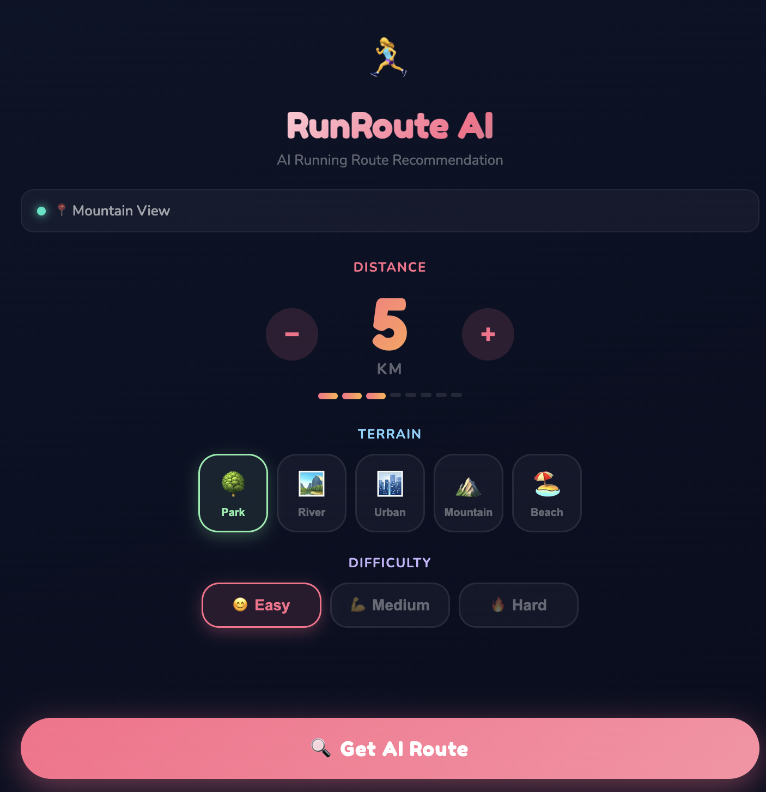
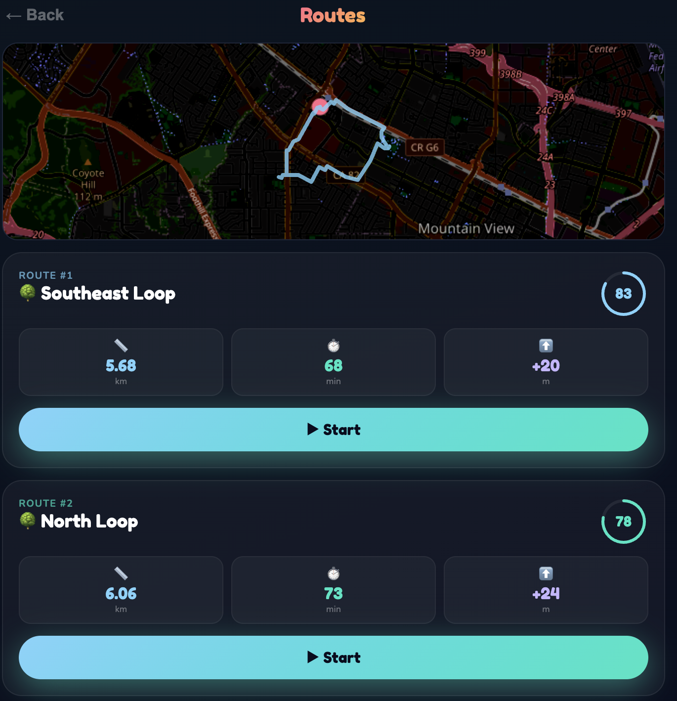
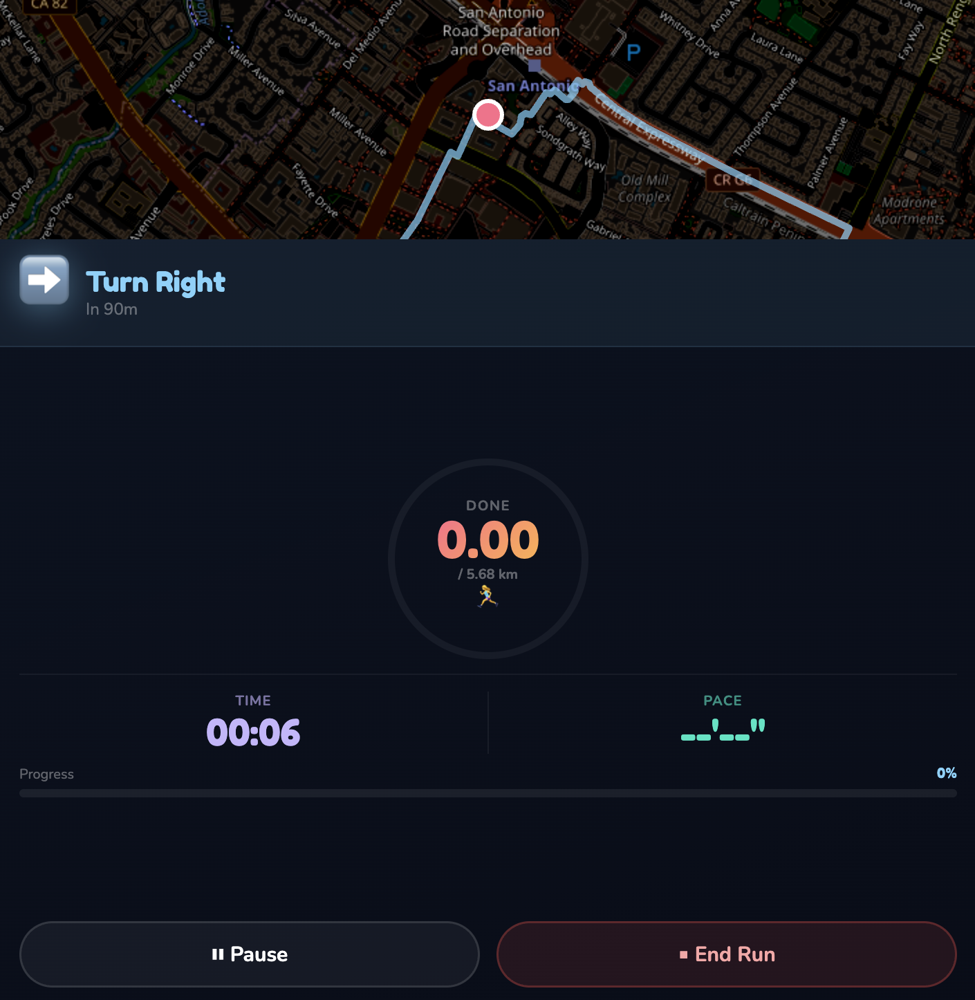
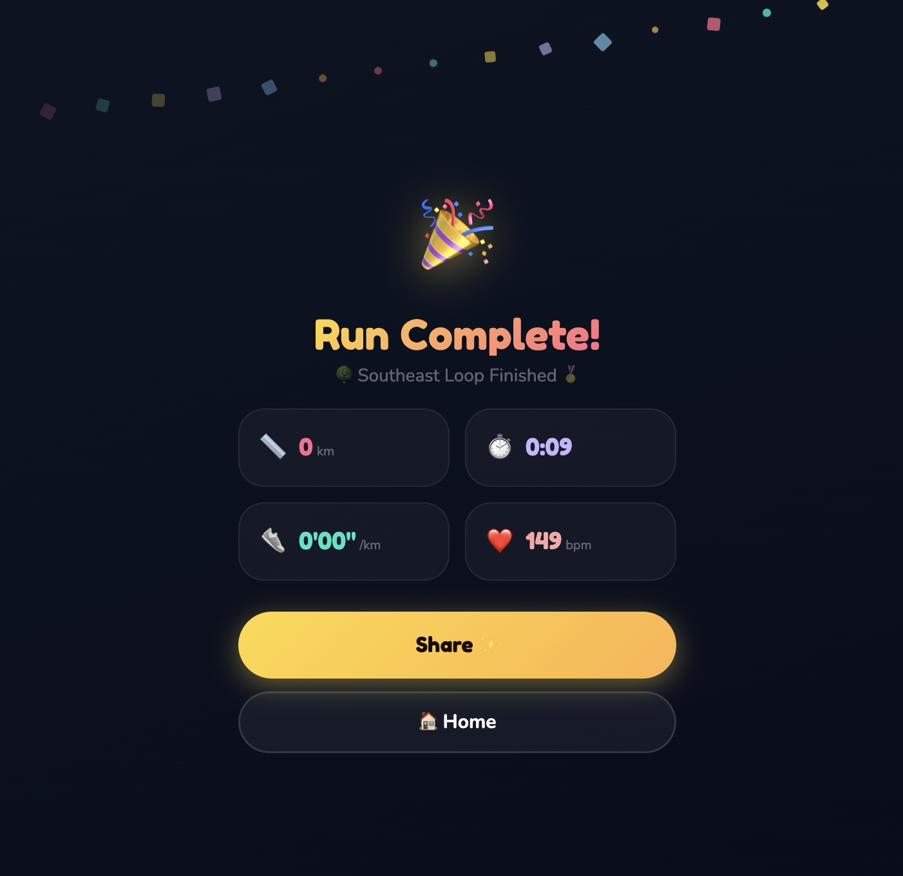
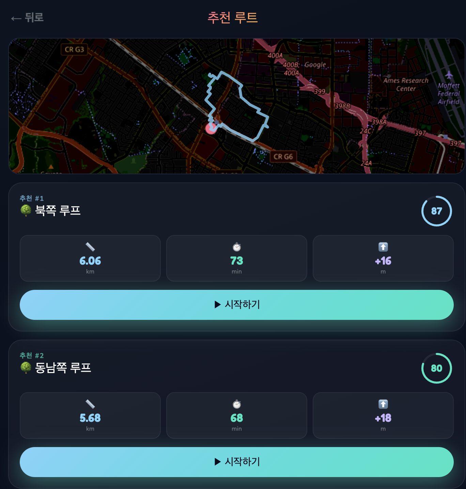
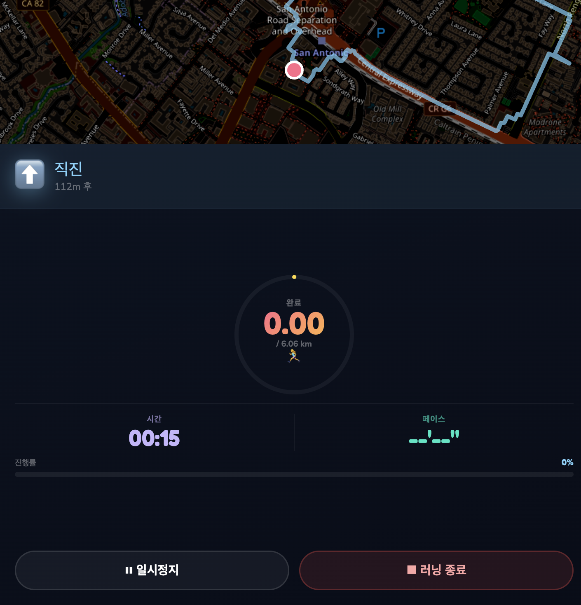

# RunRoute AI 🏃‍♀️

AI-powered running route recommendation PWA (Progressive Web App).

Recommends pedestrian-safe running routes based on your GPS location, preferred distance, terrain, and difficulty level.

## Demo

| Version | Description |
|---------|-------------|
| `demo/frontend/` | Korean PWA |
| `demo/frontend-en/` | English PWA |
| `demo/backend/` | Express.js API server |

## Smart Watch UI Design

9-screen interactive smartwatch UI design inspired by Nike x Strava.


[View Interactive Design (Claude Artifact)](https://claude.ai/public/artifacts/b2416594-ee46-46ae-8aaa-66a0c71fb63f) | Source: `Design/runroute-watch-design.jsx`

## Demo Screenshots

> Screenshots below are from the **demo version** of the app.

### English Version

| Setup | Route List | Navigation | Complete |
|-------|-----------|------------|----------|
|  |  |  |  |

### Korean Version

| Setup | Route List | Navigation | Complete |
|-------|-----------|------------|----------|
|  |  |  |  |

## Tech Stack

- **Frontend**: React + Vite (PWA)
- **Backend**: Express.js (Node.js)
- **Routing API**: OpenRouteService `foot-walking` profile (pedestrian-only roads)
- **Maps**: Leaflet.js with dark theme
- **Design System**: Fredoka One / Nunito fonts, dark navy theme (#080D1E)
  - Colors: Coral `#FF6B8A`, Mint `#00E5C3`, Lavender `#C4B5FD`, Sun `#FFD93D`, Sky `#7DD3FC`, Peach `#FFB347`

## Features

- GPS-based location detection with reverse geocoding
- AI route recommendation (3 routes per request: North, Southeast, Southwest loops)
- Pedestrian-safe roads only (OpenRouteService foot-walking profile)
- Interactive map with route visualization (Leaflet.js)
- Real-time GPS navigation with turn-by-turn instructions
- Progress tracking (distance, time, pace)
- Off-route detection
- Run completion screen with stats (distance, duration, pace, heart rate)
- PWA installable on iPhone Safari ("Add to Home Screen")
- Route caching for performance
- HTTPS for mobile GPS support (self-signed certificates)

## Getting Started

### Prerequisites

- Node.js 16+
- OpenRouteService API key ([get one free](https://openrouteservice.org/dev/#/signup))

### 1. Generate SSL Certificates

```bash
cd demo/frontend/certs
openssl req -x509 -newkey rsa:2048 -keyout key.pem -out cert.pem -days 365 -nodes -subj '/CN=localhost'
```

### 2. Install Dependencies

```bash
cd demo/frontend && npm install --legacy-peer-deps
cd ../backend && npm install
```

### 3. Configure API Key

Edit `demo/backend/server.js` and set your OpenRouteService API key:
```javascript
const ORS_API_KEY = 'your-api-key-here';
```

### 4. Run

```bash
# Terminal 1: Backend
cd demo/backend && node server.js

# Terminal 2: Frontend (Korean)
cd demo/frontend && npx vite --host 0.0.0.0 --port 3000

# Terminal 3: Frontend (English)
cd demo/frontend-en && npx vite --host 0.0.0.0 --port 3001
```

### 5. Access

- **Local**: https://localhost:3000 (Korean) / https://localhost:3001 (English)
- **Mobile**: https://YOUR_IP:3000 (same WiFi network)
- **Public**: Use [ngrok](https://ngrok.com) → `ngrok http https://localhost:3000`

## Architecture

```
iPhone Safari ──→ Vite Dev Server (:3000) ──proxy──→ Express Backend (:4000) ──→ OpenRouteService API
                        │                                    │                    (foot-walking)
                   React PWA                           Route Generation
                   Leaflet Maps                        Caching & Fallback
                   GPS Tracking                        Turn-by-turn Steps
```

## Project Structure

```
runroute/
├── demo/
│   ├── frontend/          # Korean PWA
│   │   ├── src/
│   │   │   ├── App.jsx           # Main app (screen state machine)
│   │   │   ├── App.css           # Design system & animations
│   │   │   └── screens/
│   │   │       ├── SetupScreen.jsx       # Distance, terrain, difficulty picker
│   │   │       ├── LoadingScreen.jsx     # AI analysis animation
│   │   │       ├── RouteListScreen.jsx   # Map + route cards
│   │   │       ├── NavigationScreen.jsx  # Real-time GPS navigation
│   │   │       └── CompleteScreen.jsx    # Run results + confetti
│   │   ├── certs/                # SSL certificates (not in repo)
│   │   └── vite.config.js       # Vite + HTTPS + proxy config
│   │
│   ├── frontend-en/       # English PWA (same structure)
│   │
│   └── backend/
│       └── server.js      # Express API server
│
├── Design/
│   └── runroute-watch-design.jsx  # Apple Watch UI design (9 screens)
│
└── RunRoute_AI_Complete/  # Original project reference
    ├── RunRoute_AI_PRD_v2.0.pdf
    ├── backend/           # NestJS (reference)
    ├── ai-service/        # FastAPI (reference)
    ├── ios/               # Swift (reference)
    ├── android/           # Kotlin (reference)
    ├── watchos/           # SwiftUI (reference)
    └── wearos/            # Compose (reference)
```

## Development History & Troubleshooting

### Phase 1: Initial Setup
- Started from Claude Chat-generated project (NestJS + FastAPI + iOS + Android + watchOS + WearOS)
- Decided on PWA approach since Xcode was not available
- Set up Vite + React frontend and Express.js backend

### Phase 2: Mobile Access Issues
| Problem | Cause | Solution |
|---------|-------|----------|
| iPhone Safari "server stopped responding" | Mac on Ethernet, iPhone on WiFi (different networks) | Connected Mac to same WiFi |
| GPS error on iPhone | HTTP doesn't allow Geolocation API on mobile Safari | Generated self-signed SSL certs, switched to HTTPS |
| "루트 추천 실패" after first request | HTTPS frontend calling HTTP backend (Mixed Content) | Made backend HTTPS + Vite proxy (`/api` → `https://localhost:4000`) |

### Phase 3: Route Quality Issues
| Problem | Cause | Solution |
|---------|-------|----------|
| ~60 second response time | OSRM public server timeout with default TCP timeout | Added 5s timeout, parallel requests with `Promise.all`, fallback route generation |
| Circle routes instead of roads | OSRM failures triggered geometric fallback | Improved retry logic: full loop → simple out-and-back → fallback |
| Car-only roads in recommendations | OSRM `foot` profile still included highways | Switched to OpenRouteService `foot-walking` profile |
| Response time after ORS switch | - | ~800ms average (from ~60s) |

### Phase 4: Deployment
- Set up ngrok for public URL access
- Created English version with separate ngrok tunnel
- Korean friends testing from Seoul via ngrok URLs

### Code Issues Fixed
| Error | Cause | Fix |
|-------|-------|-----|
| `Identifier 'routes' has already been declared` | Duplicate variable declaration after refactoring to Promise.all | Removed duplicate `const routes = []` |
| `react-leaflet` peer dependency conflict | Version mismatch | Used `--legacy-peer-deps` flag |
| `poppler` not installed | Needed for PDF reading | `arch -arm64 brew install poppler` |
| Vite binary broken in copied frontend-en | `cp -r` copied symlinks as files | Symlinked `node_modules` from original frontend |

## API Reference

### POST `/api/v1/routes/recommend`
Request:
```json
{
  "lat": 37.5665,
  "lng": 126.978,
  "distance_km": 5,
  "terrains": ["park"],
  "difficulty": "easy"
}
```

Response:
```json
{
  "routes": [
    {
      "id": "route_xxx",
      "name": "🌳 North Loop",
      "distance_km": 5.2,
      "duration_min": 42,
      "elevation_gain": 15,
      "safety_score": 85,
      "scenery_score": 72,
      "total_score": 81,
      "geometry": { "type": "LineString", "coordinates": [...] },
      "steps": [...]
    }
  ],
  "metadata": { "location": {...}, "elapsed_ms": 831 }
}
```

### POST `/api/v1/routes/:id/start`
Start a navigation session.

### POST `/api/v1/routes/:id/complete`
Complete a run with stats.

### GET `/health`
Health check endpoint.

## License

MIT

## Built With

🤖 Developed with [Claude Code](https://claude.ai/claude-code) (Claude Opus 4.6)
